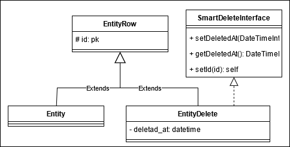

# SmartDeleteBundle

## Command
One command to generate you deleted entities
````shell script
./bin/console bfy:smart-delete
````

How it works ?
1. The command scan the entities of default entity manager
2. For each entity:
    1. The original entity save into ``smart_delete.entity_main.backup``
    2. The ``{Entity}Row`` class file generate inside ``smart_delete.entity_row.dir``
    3. The ``{Entity}Deleted`` class file generate inside ``smart_delete.entity_delete.dir``
    4. The ``{Entity}`` class file inside ``smart_delete.entity_main.dir``
3. When you delete an entity with an ``ObjectManager``, the same entity is saves into the database for suppression.

## Entities
This paragraph expose the principe of different entity generated

- ``{Entity}Row`` this entity is the image of db and base on original Entity.
- ``{Entity}Deleted`` this entity is a child of ``{Entity}Row`` and it has an extra attribute deleted_at.
- ``{Entity}`` this is your entity with some edition. It extends of: ``{Entity}Row``



## Test

````shell script
./bin/console --env=test doctrine:database:drop -c default --force
./bin/console --env=test doctrine:database:drop -c deleted -f

./bin/console --env=test doctrine:database:create -c default
./bin/console --env=test doctrine:database:create -c deleted
./bin/console --env=test doctrine:schema:create --em=deleted
./bin/console --env=test doctrine:schema:create --em=default
````
